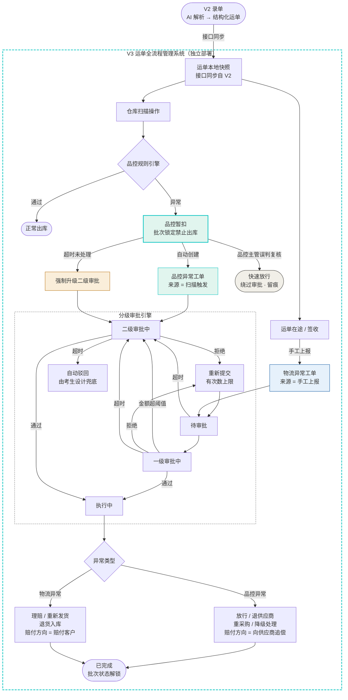

# AI 考试题目：运单全流程管理系统 V3
## 录单 → 扫描品控 → 异常上报 → 分级审批 → 执行联动 —— 运单全生命周期管理

## 一、项目背景

### 1.1 系统定位

本系统是**运单全生命周期管理平台**，承接 V2（AI 录单解析）的输出数据，覆盖运单从入仓到交付完成的完整链路。V3 不再是挂接在 V2 数据库上的扩展模块，而是一个**独立部署、独立数据库的系统**，通过接口服务与 V2 数据互通。

各阶段职责划分如下：

| 阶段 | 所属系统 | 触发方式 | 核心动作 |
|---|---|---|---|
| 录单解析 | V2（已有） | 人工上传/导入 | AI 解析任意格式出库单 → 结构化运单数据 |
| 仓库扫描品控 | V3（新增） | 扫描操作自动触发 | 品控规则引擎检测 → 通过出库 / 异常暂扣 |
| 物流异常上报 | V3（新增） | 操作人手工上报 | 丢件/破损/拒收/超时/地址错误 → 创建工单 |
| 分级审批 | V3（新增） | 工单状态机驱动 | 一级/二级审批，超时自动流转，并发冲突保护 |
| 执行联动 | V3（新增） | 审批通过后触发 | 赔付/库存/退仓/重采购，保证一致性 |

### 1.2 运单全流程设计图

下图展示了运单从录单到最终关闭的完整路径，以及两类异常（品控/物流）如何汇入同一套分级审批引擎：



### 1.3 核心难点说明

相较 V2 偏向"单点智能解析"，V3 的核心难点集中在三个方向：

**状态机设计完整性**：品控扫描批次与异常工单是两套独立状态机，需分离管理、通过 ticket_id 关联；品控暂扣的超时时长独立于审批超时，货物压仓成本驱动其应远短于审批超时。

**多表与跨系统一致性**：审批状态变更与下游库存/赔付联动不能出现中间态；V3 不直接持有 V2 运单主数据，快照数据的新鲜度和 V2 服务不可用时的降级方案均需设计。

**需求留白的自补全能力**：分级审批金额阈值、各类超时时长、品控规则触发条件、品控主管权限边界等题目均未给出精确数值，**识别留白点、补全得合理**本身是核心考点，对应考点6和《需求理解与假设说明》文档。

**特别说明（请仔细阅读）**：业务规则部分故意不给精确数值，这不是题目疏漏，而是有意为之——现实中产品经理的需求经常不完整，工程师需要主动判断、主动假设、必要时主动反问。是否能识别留白点并补全合理，直接对应"考点6"，不是可选项。

## 二、技术要求

| 项目 | 要求 |
|---|---|
| 技术栈 | Next.js App Router + TypeScript,延续 V2 项目结构 |
| 部署 | Vercel,**独立的项目/独立的部署**,提供可访问 URL(与 V2 是两个独立的 Vercel 项目) |
| UI 风格 | 与鲸天系统保持一致的设计语言(主色 #0fc6c2、圆角卡片、清爽蓝绿色调),与 V2 视觉统一 |
| 系统架构 | **V3 与 V2 是两个独立系统,各自独立部署、独立数据库,不共享同一套数据库连接**。两个系统之间的运单数据交互必须通过**接口服务(HTTP API)**完成,不允许 V3 直接连接 V2 的数据库读写数据 |
| 数据基础 | V3 自己的数据库里**不直接持有完整运单主数据**,而是通过调用 V2 暴露的接口获取运单信息(详见"3.5 系统间接口契约");异常工单必须关联到通过接口校验为真实存在的运单,不允许使用虚构/不关联的演示数据 |
| 大模型(可选加分项) | 可调用大模型辅助:(a) 根据异常描述文本自动判断异常类型与严重度;(b) 根据历史审批记录给出"建议审批意见"供审批人参考。AI 给出的判断/建议必须明确标注"AI 建议,需人工确认",不能自动执行;**给出"建议审批意见"时需说明依据(比如参考了哪几条历史审批记录),不能是黑箱结论;此外 AI 服务超时或调用失败时不能阻塞主流程,上报/审批必须能在不依赖 AI 的情况下正常走完整套流程** |
| 数据库 | V3 使用**自己独立的** Neon / Supabase / Turso 数据库实例(可与 V2 同厂商但不同实例/不同库),用于存放异常工单、审批记录、赔付记录等 V3 自有数据;不允许直接连接 V2 数据库 |

## 三、核心数据模型与状态机

### 3.1 涉及的表(至少)

| 表名 | 说明 | 必填 |
|---|---|---|
| 运单本地快照表(V3 自有) | **不是 V2 的原始运单表**,而是 V3 通过接口从 V2 拉取运单信息后,在本地保存的一份"只读快照/缓存",用于异常工单关联展示;字段至少包含运单号、收发件信息摘要、金额、来源接口同步时间。不允许在此表上直接写入/篡改运单状态,运单状态变更只能通过调用 V2 接口或在工单详情页展示"以 V2 为准" | 是 |
| 接口同步日志表 | 记录每一次调用 V2 接口的时间、接口名、请求参数摘要、响应状态、是否成功,用于排查跨系统数据不一致问题 | 是 |
| 异常工单表 | 记录异常类型、上报时间、上报人、当前状态、关联运单号(关联的是上面"运单本地快照表"中已通过接口校验真实存在的运单) | 是 |
| 审批记录表 | 记录每一次审批动作:审批人、审批层级、审批意见、时间、结果 | 是 |
| 赔付记录表 | 审批通过且需要赔付时生成,记录赔付金额、状态、关联财务对账方式(可只做记录,不接真实支付);**必须包含"赔付方向"字段**:物流异常赔付方向为"赔付给客户"（货损理赔），品控异常赔付方向为"向供应商追偿"（来货质量问题），两者金额、对账逻辑不同，不能混同一字段 | 是 |
| 库存表(V3 自有,或通过接口联动 V2/WMS) | 赔付/退货/重新发货会联动库存变化;库存数据是否也独立于 V2、是否也要通过接口同步,由考生自行设计并在假设说明文档中写明理由 | 是 |
| 扫描记录表(V3 自有) | 记录每一次扫描操作:扫描 ID、关联运单号、SKU、扫描时间、操作人/设备、品控判定结果（通过/异常）、异常描述、货物批次锁定状态、关联工单 ID（异常时非空）。与工单表是 **1:N 关系**（同一张工单可对应多条扫描记录，因同一批次重复扫描只追加记录不新建工单）;**品控暂扣状态与异常工单状态分离管理**，两者通过工单 ID 关联而非合并为同一张表 | 是 |
| 品控规则表(V3 自有) | 可配置的品控触发规则：规则 ID、异常子类型、触发条件（数量差异阈值/破损等级/规格偏差范围等）、严重度等级、是否自动创建工单、自动进入哪级审批。**不允许硬编码触发条件**，需实现为后台可调整的配置项，延续 V2 规则引擎设计理念 | 是 |

### 3.2 异常类型(至少覆盖,可扩展)

**物流类异常**（发货后，手工上报）：丢件、破损、客户拒收、超时未签收、收货地址错误。每种异常类型对应的下游处理动作不同（比如地址错误通常只需要重新发货、不涉及赔付；丢件/破损通常涉及赔付并需要回滚原运单库存），具体的对应关系**题目不直接给出,由考生根据业务常识设计并在假设说明文档中写明**。

**品控类异常**（发货前，扫描自动触发）：数量不符、外观破损、规格不符、标签错误、批次异常。品控类异常与物流类异常在以下三点上有本质区别，考生必须在设计中体现并在假设说明文档中说明：
- **触发源不同**：品控异常由扫描系统自动创建工单，物流异常由操作人手工上报
- **货物状态联动不同**：品控异常触发后货物进入"品控暂扣"状态（批次锁定，禁止出库），工单关闭前该批次 SKU 不可被其他运单引用；物流异常不涉及此状态
- **赔付方向不同**：品控异常赔付方向是向供应商追偿，物流异常赔付方向是赔付给客户，使用同一张赔付记录表但"赔付方向"字段不同

### 3.3 状态机(必须覆盖的状态与分支)

**工单状态机（物流类异常，手工上报路径）**
```
待审批 → 一级审批中 → [金额超过阈值] → 二级审批中
                ↓ 通过                      ↓ 通过
            执行中(理赔/重新发货/退货入库)   执行中
                ↓                            ↓
            已完成                        已完成

一级审批中 / 二级审批中 → 拒绝 → 待审批(允许重新提交,有次数上限)
                                  → 超过次数上限 → 自动升级 / 关闭(由考生自行决定并说明理由)

待审批 / 一级审批中 / 二级审批中 → 超时未处理 → 自动升级或自动驳回(由考生自行决定并说明理由,
                                                  超时时长本题不给出具体数值,需自行设定)
```

**扫描批次状态机（品控类异常，扫描自动触发路径）—— 新增，与工单状态机分离管理**
```
扫描录入 → 品控规则引擎检测
                ↓ 通过
            正常出库（批次状态 = 可出库，流程结束）

                ↓ 异常
            品控暂扣（批次状态 = 锁定，禁止出库）
            ↙ 超时未处理（超时时长独立设定，应短于审批超时，具体数值需考生自行设定）
        强制升级二级审批
        （自动进入右侧工单审批流程中的二级审批环节）

            ↘ 品控主管发起误判复核
            快速放行（绕过审批，批次状态直接解锁）
            [仅品控主管角色可操作，需留痕记录复核原因]

            ↓ 正常路径：自动创建异常工单（来源标记 = 扫描触发）
            → 进入工单审批流程（同物流类异常的分级审批状态机）
            → 执行中（品控专有动作）:
                放行货物（批次解锁，无赔付）
                退回供应商 + 向供应商追偿（批次出库→退仓，生成赔付记录，方向=追偿）
                重新采购 + 向供应商追偿（批次作废，生成采购任务，生成赔付记录，方向=追偿）
                降级处理（批次降价出库，生成赔付记录，方向=追偿差价）
            → 已完成（批次状态解锁，工单关闭）
```

**两个状态机的关联规则（必须实现）**：
- 扫描批次状态与工单状态通过 `scan_records.ticket_id` 关联，工单关闭前批次不得自动解锁
- 同一批次同一 SKU 存在未关闭品控工单时，重复扫描只追加扫描记录，不重新创建工单（幂等性）
- 品控工单审批通过执行动作时，必须同步更新扫描批次状态，两个状态变更需在同一事务内完成

### 3.4 业务规则(故意留白,需要考生自己补全)

分级审批:不同异常金额对应不同审批层级,具体的金额阈值题目不给出,需要考生自己设定一套
**可配置**的分级规则(不要写成 if amount > 500 这种硬编码,设计理念可以参考 V2 的"规则
引擎"思路),并在假设说明文档中给出设定依据。

超时时长:多久算"超时未处理",题目不给出具体数值,需要考生自行设定并说明理由。

重新提交次数上限:拒绝后允许重新提交几次,题目不给出具体数值,需要考生自行设定并说明理由。

品控暂扣超时时长:品控暂扣的超时时长**独立于**审批超时时长，不能共用同一个配置值。品控暂扣超时意味着"货物压仓产生运营成本"，应远短于审批环节超时，具体数值题目不给出，需要考生自行设定并说明理由（同时需说明超时后是强制进入二级审批还是其他处理方式）。

品控规则触发阈值:品控规则引擎的触发条件（如数量差异超过多少%算异常、破损达到几级触发哪级审批）题目不给出，需要考生自行设计并在假设说明文档中给出依据，且必须实现为可配置项，不允许硬编码。

品控主管角色权限边界:题目不给出"品控主管"角色的具体权限范围，需要考生自行设计：品控主管能否操作"误判快速放行"、与一级/二级审批人的权限是否重叠、一个人是否可以同时兼任多个角色等，均需在假设说明文档中明确说明。

### 3.5 系统间接口契约(V3 调用 V2,核心考点)

题目不规定具体的接口技术形式(REST / GraphQL / RPC 均可),但必须满足以下要求,由考生
自行设计接口契约并在提交物中提供接口文档:

**至少需要的接口能力**:
- 校验运单是否存在 + 获取运单详情（用于发起异常上报时的真实性校验）
- **校验 SKU 是否归属于指定运单**（用于扫描录入时验证该 SKU 确实在该运单的 SKU 明细中，避免扫描到无关货物）
- 按条件查询/同步运单列表（用于本地快照表的初始化或增量同步）
- （可选，加分项）异常处理结果回写 V2，比如运单进入异常处理中时，V2 侧的运单详情页也能看到"该运单存在未关闭异常"的标记，避免 V2 那边继续按正常运单处理（比如重复发货）

**鉴权与安全**:V3 调用 V2 接口、以及(如果做了回写)V2 调用 V3 接口,都需要有鉴权机制
(API Key / Token 均可,不要求做到企业级 OAuth),不能是完全开放无鉴权的接口。

**异常处理(必须实现)**:
- 接口超时:需设置合理超时时间,超时后给用户明确提示,不能让前端无限转圈
- 接口失败重试:至少有基础的重试机制(比如重试 1-2 次),重试逻辑需说明幂等性如何保证
- V2 服务整体不可用时的降级方案:比如允许基于本地快照表的"上一次同步数据"继续展示
  (并明确标注"数据可能非最新,获取自 XX 时间"),而不是整个 V3 系统直接白屏/报错

**数据新鲜度与一致性**:
- 需说明本地快照表的数据多久同步一次/什么触发同步(比如每次上报异常时实时拉取一次最新运单信息、
  还是定时批量同步),并在假设说明文档中给出选择依据
- 需考虑"V2 运单信息在异常处理期间发生变更"这种边界情况(比如金额被 V2 那边更正了),
  说明 V3 如何感知并处理这种不一致(实时校验 / 定期对账 / 仅记录差异由人工介入,任选其一并说明理由)

## 四、功能需求

### 模块零:扫描操作与品控检测（新增，品控异常的触发源）

支持扫描录入（可用手工输入条码/SKU 编号模拟扫描枪，不强制要求接入真实硬件），录入时必须通过 V2 接口校验该 SKU 归属于真实存在的运单，不允许扫描不存在的 SKU。

扫描录入后，系统根据品控规则表中的可配置规则自动判定结果（通过 / 异常），规则引擎的执行过程需可追溯（记录命中了哪条规则、判定依据是什么）。

**品控暂扣（必须实现）**：判定异常后立即将该 SKU 批次置为"品控暂扣"状态，期间该批次不可被其他运单引用（库存层面锁定），同时自动创建异常工单，工单来源标记为"扫描自动触发"。手工上报创建的工单来源标记为"手工上报"，两类工单在列表中需有明显区分。

**扫描幂等性（必须实现）**：同一运单下同一 SKU 批次在品控工单未关闭期间，重复扫描只追加扫描记录，不重复创建工单，也不重置暂扣状态，并向操作人明确提示"该批次已存在未关闭品控工单"。

**误判快速放行（必须实现）**：仅"品控主管"角色可操作，用于品控主管认定扫描结果为误判时直接解锁批次、关闭工单，绕过完整审批流程。操作需填写复核原因，留痕记录，不允许静默放行。

**接入大模型（可选加分项）**：可调用大模型辅助根据扫描描述文本和图片（如有）推荐品控异常子类型及严重度，需明确标注"AI 建议，需人工确认"。

### 模块一:异常工单上报(基础能力)

支持从已有运单(通过调用 V2 接口获取)发起异常上报,**不允许对不存在的运单发起异常**——
真实性校验必须实际调用 V2 接口完成,不能只校验本地快照表(快照可能过期/未同步),
至少在发起上报这个关键动作上要做一次实时接口校验。

**归属校验(必须实现)**:若鲸天系统涉及多商户/多仓库,上报人只能对自己所属仓库/商户的运单发起异常上报,不能跨租户操作他人运单;审批人列表同理只能看到自己权限范围内的工单。若考生的 V2 数据本身不区分租户,需在假设说明文档中注明"单租户假设"并简要说明如果要支持多租户会如何调整表结构和查询逻辑。

同一运单存在**同类型**未关闭的异常工单时,不允许重复上报,需明确提示已有工单状态。不同类型的异常（如品控工单未关闭期间又发生物流丢件）是否允许并存，题目不作强制规定，由考生自行判断并在假设说明文档中说明理由。

上报时需选择异常类型,描述具体情况;如接入大模型辅助分类,需展示 AI 建议的类型并允许
人工修改。

### 模块二:分级审批流程引擎(核心考点)

按 3.3 的状态机实现完整的审批流转,审批人在列表中能看到待自己处理的工单,可填写审批
意见并选择通过/拒绝。

分级规则需要可配置(后台能调整阈值,而不是改代码),呼应 V2 的"规则引擎,而非硬编码"
设计理念。

**并发冲突处理(异常分支,必须实现)**:两个审批人同时打开同一条待审批工单,只能有一个
人的操作生效,另一个人提交时需要明确提示"该工单已被处理,请刷新",不能出现两条互相
矛盾的审批记录。

**审批人离职/账号禁用兜底(异常分支,必须实现)**:审批人账号被禁用后,分配给他的待审批
工单需要有兜底机制(转交他人或上报异常),不能让工单永久卡死在无人处理的状态。

**超时自动流转(异常分支,必须实现)**:超过设定时长未处理的工单,按 3.4 设定的规则自动
升级或驳回,需要有后台任务或等效机制触发,不能靠人工手动检查。

**权限边界(异常分支,必须实现)**:需设计角色权限模型,明确"谁能上报""谁能审批一级""谁能审批二级"。**上报人不能审批自己提交的工单**(自批自核是常见真实漏洞),非对应层级/非对应权限范围的审批人不能对工单做审批操作,前端隐藏入口不算数,后端接口必须有相应校验。

**幂等性(异常分支,必须实现)**:审批人因网络抖动重复点击"通过"/"拒绝",或后台任务重试触发同一动作,不能导致重复生成审批记录、重复扣减/增加库存、重复生成赔付记录。需说明采用的幂等手段(比如基于工单当前状态做前置校验、唯一约束、操作令牌等)。

### 模块三:执行联动 —— 赔付与库存一致性(核心考点)

审批通过后,根据异常类型联动执行不同动作:理赔(生成赔付记录)、重新发货(联动库存扣减)、
退货入库(联动库存增加)。

**一致性要求**:审批状态变更与下游库存/赔付的联动操作,必须保证不出现"审批显示已通过,
但库存没联动成功"这种中间态。具体用数据库事务、补偿任务还是别的机制保证,由考生自行
设计并说明理由 —— 这一点不会在功能列表里反复强调,但属于核心考点,容易被忽略。

**可追溯性要求**:赔付记录、库存变更记录必须能反查回是由哪一条审批记录触发的(比如保留审批记录 ID 作为外键关联),不能出现"库存变了/赔付生成了,但说不清是哪次审批导致的"这种断链情况。

### 模块四:工单列表与追踪

列表支持按状态、异常类型、运单号、审批人筛选,支持分页。

工单详情页展示完整的状态变更历史和每一次审批意见,类似审计日志,能看清"谁在什么时候
做了什么决定"。

即将超时的工单在列表中需要有醒目提示(颜色/角标即可,不强制要求接入钉钉机器人,接入了
作为加分项)。

**规模化场景(轻量级要求)**:模拟生成至少 200 条异常工单(覆盖不同状态、不同异常类型),验证列表筛选、分页、统计在数据量较大时依然流畅,不要求达到 V2 的"1000单10秒"级别压测标准,但不能只用 3-5 条数据演示就算完成。

### 模块五:跨系统接口与数据一致性(核心考点)

提供一个简单的接口状态/同步监控页面(或区域),展示:最近一次与 V2 接口同步的时间、
同步成功率、最近的接口调用日志(取自接口同步日志表),方便排查"数据为什么对不上"。

工单详情页在展示运单信息时,需明确标注该信息的来源("实时获取自 V2"还是"使用本地
缓存,同步于 XX 时间"),不能让用户误以为本地快照永远等于 V2 最新状态。

V2 接口不可用时,系统需有清晰的降级提示(而不是整体报错崩溃),并在恢复后能继续正常工作,
不需要人工介入修复。

### 模块六:《需求理解与假设说明》文档(强制交付物)

不是代码,是一份文档,必须随项目一起提交,至少包含:

题目里哪些规则没有给出精确数值或没有覆盖到的边界情况，你是怎么假设/设定的，理由是什么。**至少覆盖以下九项**，每项需给出具体数值或规则及其依据：

① 分级审批金额阈值　② 审批超时时长　③ 重提次数上限　④ 物流异常类型映射（各类型对应的下游动作）　⑤ 角色权限划分　⑥ V2 数据同步频率与一致性策略　⑦ 品控暂扣超时时长（需说明为何独立于审批超时、数值如何确定）　⑧ 品控规则触发阈值（数量差异/破损等级等判定条件）　⑨ 品控主管角色权限边界（能做什么、与审批人权限是否重叠）

如果允许的话,你会向产品经理提出的问题清单(没有实际提问渠道也要写,体现你的思考过程,
这部分不是必需项,但体现主动澄清意识会加分)。

## 五、考点与评分标准(总分 100 分)

**前置要求**:项目必须部署到 Vercel 并提供可在线访问的 URL,且必须通过**调用 V2 接口**
真实校验运单存在性(而非直接连接 V2 数据库或使用虚构数据),否则本次考试计 0 分。

### 考点 1:项目搭建与部署(10 分)

| 评分要点 | 细则 |
|---|---|
| Vercel 部署 | 项目部署到 Vercel,提供可访问 URL,构建无错误,与 V2 是两个独立的部署 |
| 接口对接落地 | 确实通过 HTTP 接口与 V2 系统交互获取运单数据,而不是直接连数据库或本地造假数据 |

### 考点 2:UI 与交互体验(13 分)

| 评分要点 | 细则 |
|---|---|
| 风格统一 | 与鲸天系统及 V2 项目视觉风格一致,无明显割裂 |
| 关键交互 | 审批操作有二次确认、loading 状态、成功/失败提示;并发冲突时有清晰的错误提示而不是静默失败或报错崩溃;无权限操作(如审批自己上报的工单)需有明确提示而非按钮可点但后端报错 |

### 考点 3:状态机与审批流程设计(20 分,核心考点)

| 评分要点 | 细则 |
|---|---|
| 状态机完整性 | 3.3 中列出的状态与分支(分级审批、拒绝重提、超时自动流转、品控暂扣、快速放行)均有实现，每缺一个关键分支扣 4 分，**本子项最低扣至 0 分，不产生负分** |
| 分级规则可配置 | 审批层级规则是可配置的(后台可调阈值),而不是写死在代码里;阈值设定在假设说明文档中有合理依据 |
| 并发冲突处理 | 同一工单被两人同时操作时,有明确的互斥/版本控制机制,不出现矛盾的审批记录 |
| 审批人兜底机制 | 审批人离职/禁用后,待审批工单有明确的转交或上报机制,不会永久卡死 |
| 权限边界 | 角色权限模型清晰,上报人不能审批自己提交的工单,非对应层级/范围的审批人无法越权操作,后端接口有相应校验(非仅前端隐藏) |
| 幂等性 | 重复点击审批操作或后台任务重试,不会导致重复扣库存/重复生成赔付记录/重复审批记录 |

### 考点 4:系统内多表关联与数据一致性(15 分,核心考点)

| 评分要点 | 细则 |
|---|---|
| 表结构设计 | 异常工单、审批记录、赔付记录、运单快照、库存之间的关联关系清晰、范式合理 |
| 审批与下游联动的一致性 | 审批通过后库存/赔付的联动变更与状态变更保证一致,不出现"通过了但联动没生效"的中间态;事务/补偿机制设计合理 |
| 可追溯性 | 赔付记录、库存变更记录能反查回触发它们的具体审批记录(如保留审批记录 ID 关联),不存在断链情况 |
| 异常类型与下游动作映射 | 不同异常类型(丢件/破损/拒收/地址错误等)触发的下游处理动作设计合理,逻辑自洽 |

### 考点 5:跨系统接口与数据一致性(15 分,核心考点)

| 评分要点 | 细则 |
|---|---|
| 接口设计合理性 | V3 与 V2 之间通过接口完成数据交互(校验运单存在、获取运单详情/列表),接口契约清晰,有鉴权机制,而非裸奔的开放接口 |
| 真实性校验落地 | 发起异常上报时确实调用接口做了实时校验,不是仅凭本地快照判断,杜绝"伪对接"(比如把 V2 数据导出一份静态 JSON 充当接口返回值) |
| 接口异常处理 | 接口超时、调用失败有合理的重试与提示;V2 服务不可用时有明确的降级方案,不是整体白屏或无限转圈 |
| 数据新鲜度与一致性策略 | 本地快照表的同步机制(实时拉取/定时同步)设计合理并有依据;能说清楚"V2 数据变更但 V3 还没感知到"这种边界情况怎么处理 |
| 一致性可观测性 | 提供接口同步日志/监控页面,数据来源(实时 vs 缓存)在前端有明确标注,出问题时能定位是哪次接口调用导致的不一致 |
| **接口可调试性** | 每次跨系统调用需生成可追踪的 Request ID 并写入接口同步日志表,日志需包含:调用时间、接口名、入参摘要、响应状态码、耗时、错误信息(如有);错误日志对排查有意义(比如区分"V2 返回 404 运单不存在"和"网络超时"),而不是统一抛 `Internal Server Error`。能通过 Request ID 在日志里还原一次完整调用链的候选人得满分,没有任何链路追踪的扣 3 分 |
| **老系统二开意识** | 假设说明文档中需说明:如果 V2 原本没有现成的对外接口,你会如何在不破坏 V2 现有调用方的前提下新增接口(比如接口版本策略、字段向后兼容原则、灰度上线方案);以及 V2 接口字段升级时 V3 如何感知和应对。不要求真的去改 V2 代码,但必须体现这个工程判断意识——这在存量系统上开新业务时是最常见也最容易踩坑的地方 |

### 考点 6:需求理解与假设说明文档质量(12 分,核心考点,对应本题"信息不完整"的考核目标)

| 评分要点 | 细则 |
|---|---|
| 关键留白点覆盖度 | 是否识别并书面说明了以下九项留白规则，每漏一项扣 1 分：① 分级审批金额阈值；② 审批超时时长；③ 重提次数上限；④ 物流异常类型映射；⑤ 角色权限划分；⑥ V2 数据同步策略；⑦ **品控暂扣超时时长（独立于审批超时）**；⑧ **品控规则触发阈值**；⑨ **品控主管角色权限边界** |
| 假设的合理性 | 给出的数值/规则是否有依据(参考行业常识、成本考量等),而不是随便编一个数；品控相关的阈值是否说明了与业务成本（压仓损耗、追偿成本）的关联 |
| 主动澄清意识 | 是否体现了"如果能问产品经理会问什么"的思考(非必需项,体现了加分,不体现不扣分) |

### 考点 7:扫描链路与品控规则引擎(15 分,核心考点)

| 评分要点 | 细则 |
|---|---|
| 扫描记录与品控状态机设计 | 扫描记录表与工单表分离管理，通过 ticket_id 关联；品控暂扣状态独立于工单状态，两个状态机的关联规则清晰，不混同一张表 |
| 品控规则引擎可配置 | 触发条件（数量差异阈值、破损等级等）实现为后台可配置项，不硬编码；规则执行过程可追溯（记录命中规则 ID 和判定依据） |
| 扫描幂等性 | 同一批次存在未关闭品控工单时，重复扫描不重复创建工单；操作人有明确提示 |
| 批次锁定与解锁一致性 | 品控暂扣期间批次 SKU 不可被其他运单引用；执行动作与批次状态解锁在同一事务内完成，不出现"工单已完成但批次仍锁定"的中间态 |
| 品控主管权限隔离 | 误判快速放行仅品控主管可操作，后端接口有权限校验；操作留痕，不允许静默放行 |
| 赔付方向字段 | 赔付记录表含"赔付方向"字段，品控追偿与客户理赔明确区分，对账逻辑不混用 |

### 考点 8:满足 V2 基础能力的延续性(附加项,0 分)

本考点不计分,仅作为完整度参考:V3 是否真的通过接口与 V2 的真实数据贯通、UI 视觉是否
延续 V2 风格,而不是另起一套不相关的实现。

### 考点 9:反思题(0 分,不计分)

| 序号 | 题目 |
|---|---|
| 1 | 如果题目直接给出了精确的审批金额阈值和超时时长,你的架构设计会有什么不同? |
| 2 | 你认为本题里"审批状态变更"与"库存/赔付联动"之间的一致性,最大的风险点在哪里?如果不用数据库事务,你会怎么处理? |
| 3 | 面对一句话级别的模糊需求,你倾向于"先问清楚再动手"还是"先做出一个版本再迭代"?为什么? |
| 4 | 如果产品经理后续要求新增第六种异常类型(比如"客户投诉服务态度",不涉及货品本身、不涉及库存联动),你现在的表结构和状态机需要改动哪些地方?改动成本大不大? |
| 5 | 如果工单量从 200 条增长到 20 万条,你的系统里最先撑不住的环节是哪个(列表查询?定时任务全表扫描?接口同步积压?)?你会怎么处理? |
| 6 | 你在给 V2 新增对外接口时,如何保证不破坏 V2 现有的调用方?如果 V2 的运单金额字段类型从 `int` 改成 `decimal`,你会如何处理 V3 侧的兼容? |

## 六、评分等级对照标准

本题满分 100 分,但"多少分算通过"不是一刀切,而是按考生的职级定不同的合格线 ——
同一份题目,职级越高,要求越严。低于自己职级对应的合格线,视为本次考核不通过;
达到更高职级的合格线,可作为破格/晋升参考的加分信号,但不直接等同于晋升决定。

| 职级 | 合格线 | 说明 |
|---|---|---|
| 资深工程师 | 90 分 | 考点3/4/5/6/7 基本不丢分；两套状态机（工单+扫描批次）分离设计且关联规则完整；赔付方向、批次锁定一致性、品控主管权限隔离均无遗漏；体现对跨模块、跨系统整体把控能力 |
| 高级工程师 | 80 分 | 核心考点(考点3/4/5/6/7)允许少量缺漏，但不能在"中间态一致性""品控批次锁定与工单状态脱节""跨系统数据不一致兜底"这三类关键陷阱上失分 |
| 中级工程师 | 70 分 | 主体功能（工单状态机、多表关联、V2 接口对接、品控扫描基础流程）做对；假设说明文档可不够全面，但必须存在且覆盖核心留白点 |
| 初级工程师 | 60 分 | 完成基础状态流转、上报/审批功能、调用接口校验运单存在、扫描录入触发品控工单创建即可；品控两套状态机的分离设计和一致性保障可以不完整 |

评分等级与具体考点的对应关系,以阅卷人按本文档"五、考点与评分标准"逐项打分后得出
的总分为准,职级合格线只是及格阈值,不改变各考点本身的评分细则和权重。

## 七、提交要求

在线地址:部署到 Vercel 后的可访问 URL。

源码仓库:Git 仓库链接(GitHub / GitLab / Gitee)。

**系统间接口文档**:说明 V3 调用 V2 的接口列表、入参出参、鉴权方式、超时与重试策略、
V2 不可用时的降级方案,单独成文或在 README 中有独立章节,不能口头说明替代。

《需求理解与假设说明》文档:单独的文件,随源码一起提交,不能口头说明替代。

大模型调用说明(如有使用):说明使用的模型、Prompt 设计思路、AI 建议在哪些环节介入、
如何保证"AI 建议需人工确认"这条原则被遵守。


## 八、考试纪律声明

本次考试中,若不同考生的作品出现以下情况之一,视为作弊,该考生本次考试成绩计 0 分:

UI 高度相似(布局、配色、组件结构雷同,非通用模板所致)。

存在相同 BUG 或相同非预期行为(表明代码来源相同)。

代码结构、命名、注释高度一致。

《需求理解与假设说明》文档内容高度相似(说明假设是抄的,而不是自己想的)。
